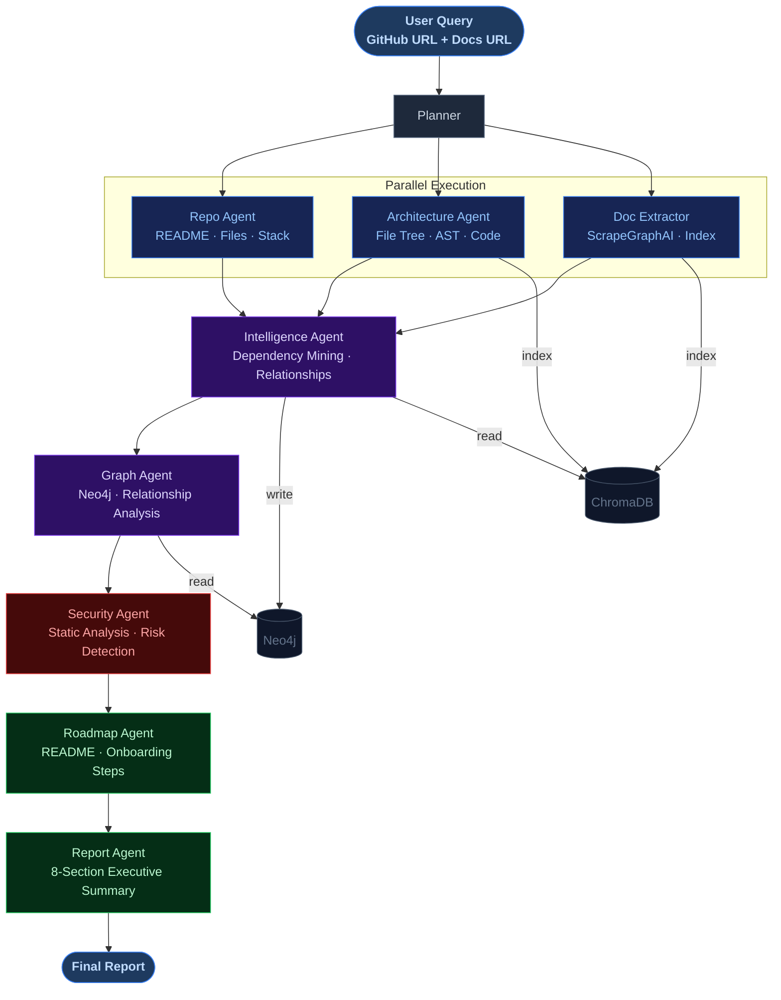

# 🧠 Graphora — GitHub Repository Analyzer

[](https://streamlit.io/)
[](https://github.com/langchain-ai/langgraph)
[](https://groq.com/)
[](https://github.com/ScrapeGraphAI/Scrapegraph-ai)
[](https://www.trychroma.com/)
[](https://neo4j.com/)
[](https://www.python.org/)
[](https://opensource.org/licenses/MIT)

---

## What is Graphora?

Graphora is a web app where you paste a GitHub repository link and it automatically analyzes the entire codebase for you.

It reads the code, fetches the documentation, finds all dependencies, checks for security issues, and gives you a clean report — without making anything up.

---

## What problem does it solve?

When you come across a new GitHub repo, understanding it takes a lot of time:
- You have to read hundreds of files
- You don't know which files are important
- You don't know what libraries it uses or why

Graphora does all of that for you in one click.

---

## How it works



---

## What's in the final report?

The report always has these 8 sections:

| Section | What it tells you |
|---|---|
| **Executive Summary** | What this project does and who it's for |
| **Architecture** | How the code is structured, key folders and files |
| **Tech Stack** | Languages, frameworks, and major libraries used |
| **Relationships** | Which modules depend on which |
| **Security** | Any real risks found in the code |
| **Risks** | Parts of the code that could break easily |
| **Top Improvements** | One concrete suggestion to make the project better |
| **Roadmap** | 5 steps to get started with the project |

> If there's no evidence for a section, it says **"No data available"** — it never makes things up.

---

## Setup

### 1. Clone the project

```bash
git clone https://github.com/tushar80rt/Graphora.git
cd Graphora
```

### 2. Create a virtual environment

```bash
python -m venv venv
venv\Scripts\activate        # Windows
# source venv/bin/activate   # Mac/Linux
```

### 3. Install dependencies

```bash
pip install -r requirements.txt
```

### 4. Create a `.env` file

Create a file named `.env` in the project folder and add:

```env
# Required
GROQ_API_KEY=gsk_xxxxx
SGAI_API_KEY=sgai_xxxxx
GITHUB_TOKEN=ghp_xxxxx

# Neo4j (for relationship features)
NEO4J_URI=bolt://localhost:7687
NEO4J_USERNAME=neo4j
NEO4J_PASSWORD=your_password

# Optional — for debugging with LangSmith
LANGCHAIN_API_KEY=lsv2_xxxxx
```

**Where to get these keys:**
- `GROQ_API_KEY` → https://console.groq.com/
- `SGAI_API_KEY` → https://dashboard.scrapegraphai.com/
- `GITHUB_TOKEN` → https://github.com/settings/tokens
- Neo4j → https://neo4j.com/download/ (Desktop) or https://neo4j.com/cloud/ (Cloud)

### 5. Run the app

```bash
streamlit run main.py
```

Open your browser at `http://localhost:8501`

---

## How to use it

1. Open the app in your browser
2. Enter your API keys in the sidebar (or load from `.env`)
3. Type your query in the chat box like:

```
Analyze https://github.com/langchain-ai/langgraph with docs https://langchain-ai.github.io/langgraph/
```

4. Wait ~30–60 seconds
5. Read the report

---

## Tech Stack

| What | Tool used |
|---|---|
| UI | Streamlit |
| AI Workflow | LangGraph |
| LLM | Groq (Llama 3.1 8B) |
| GitHub Access | MCP (Model Context Protocol) |
| Doc Extraction | ScrapeGraphAI (`sgai.extract()`) |
| Code Parsing | Tree-Sitter (Python, JS, TS, Go, Java, C++, Rust) |
| Semantic Search | ChromaDB + HuggingFace `all-MiniLM-L6-v2` |
| Relationship DB | Neo4j |
| Caching | `cachetools` TTLCache (1 hour) |

---

## Troubleshooting

**The app gives "No data available" for most sections**
→ GitHub API rate limit may have been hit. Wait ~1 hour and try again. Make sure your `GITHUB_TOKEN` is set in `.env`.

**Neo4j errors on startup**
→ Make sure Neo4j is running. Open `http://localhost:7474` in your browser to check. Or use Neo4j Aura (cloud) and update the URI in `.env`.

**`SCRAPE_ERROR: Insufficient content extracted`**
→ Check that `SGAI_API_KEY` is set correctly. Some sites block scrapers — try a different docs URL.

**ChromaDB shows no results**
→ Delete the `./chroma_db` folder and run again. The index will be rebuilt fresh.

---

## License

MIT — free to use, modify, and share.

---

**Made with ❤️ for developers who want to understand any GitHub repo instantly.**

---

*Built by **Tushar Singh***
